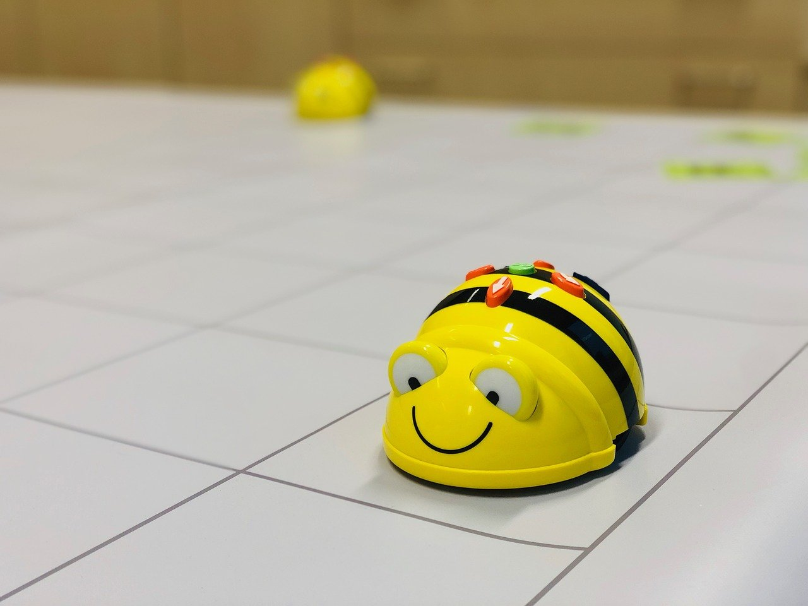

My daughter is 6 years old, and she and her classmates are currently learning about various professions. Her teacher asked us (the parents) whether they would want come into the classroom and explain their profession in 15 minutes or so. I really liked the idea of inspiring these bright young minds with some fun stories about software development, so I applied and prepared a lesson. Which turned out to be a lot harder than I thought it would be.

## Keep a primary school teacher around

"Keep it simple" I thought to myself. "These kids are 6 years old, they don't an in-depth explanation of how Java handles cryptography. Just enough content to spark their interest in software development will do." But in the same amount of time that it would have taken me to spell 'YAGNI', words like 'algorithm' and 'directive' had suddenly appeared in my lesson plan.

Luckily, I keep a primary school teacher around to help me in cases like this. :-) When my wife saw the lesson plan, she first had a good laugh at me. Then she seemed to see it fit to insult my teaching skills. "These kids are 6 years old!" she said. "They don't need words like 'algorithm'! Your lesson plan should be WAY simpler!"

She was right, of course. 

Having a primary school teacher around to ventilate your lesson ideas is a very valuable thing!
...

## What is a computer?

"A screen that allows you to play games"

## Where can you find them?

Traffic lights, satnavs, chromebooks...

## Instructions

...

## 100 teacher photos

...

## Beebot

...

Image by <a href="https://pixabay.com/users/noratheone-7789308/?utm_source=link-attribution&amp;utm_medium=referral&amp;utm_campaign=image&amp;utm_content=4096410">noratheone</a> from <a href="https://pixabay.com/?utm_source=link-attribution&amp;utm_medium=referral&amp;utm_campaign=image&amp;utm_content=4096410">Pixabay</a>

