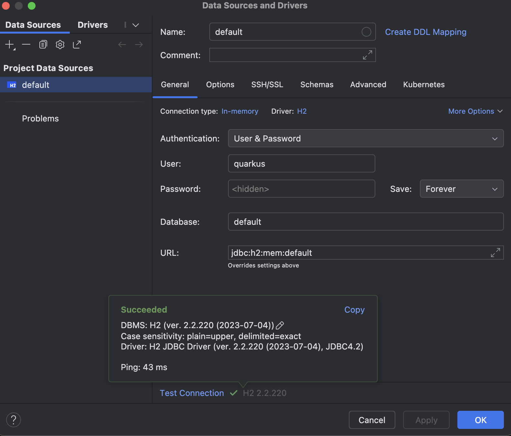

In een tijd waarin niemand nog had gehoord van Azure, AWS of Kubernetes vierden traditionele Java-frameworks zoals Struts, Spring 1.0 en J2EE hoogtij. Deze 'traditionele' frameworks waren bedacht om monolitische applicaties te bouwen die op dedicated hardware moesten draaien. Ze hadden vaak een relatief lange opstarttijd en hoge geheugenvereisten. Maar de wereld is sindsdien veranderd: moderne applicaties maken gebruik van cloudhardware, zijn ontworpen onder microservices-architectuur en vereisen een kortere opstarttijd. Eén van de frameworks waarmee je eenvoudig dit soort moderne applicaties kunt bouwen is _Quarkus_.

## Quarkus

Quarkus is een Java-framework waarmee cloud-native applicaties gebouwd kunnen worden. De aanwezige ondersteuning voor [Kubernetes](https://kubernetes.io) maakt dat een Quarkus-applicatie uitermate geschikt is voor de cloud; bovendien biedt Quarkus de mogelijkheid om met [GraalVM](https://graalvm.org) applicaties in de vorm van native images te draaien, waardoor de opstarttijd een kwestie wordt van milliseconden. 

Dit artikel helpt je om kennis te maken met Quarkus door in 30 minuten een basale applicatie op te tuigen. Wanneer je de stappen stuk voor stuk uitvoert, levert dat aan het einde een werkende applicatie op. 

> Loop je ergens vast, dan kun je in [deze GitHub-repository](https://github.com/hannotify/quarkus-guitar-store) het eindresultaat alvast bekijken om te zien waar wellicht de verschillen zitten.

## Voorbereidingen

1. Zorg er eerst voor dat je een recente versie van [Java](https://jdk.java.net/22/) en [Maven](https://maven.apache.org/) beschikbaar hebt op je machine.
2. Installeer vervolgens de [Quarkus CLI](https://quarkus.io/guides/cli-tooling).
3. Installeer daarna ook [HTTPie](https://httpie.io/cli), een command-line tool waarmee je eenvoudig HTTP-requests vanuit je terminal kunt versturen.

## Projectopzet

4. Voer het volgende commando uit:

```bash
quarkus create app com.github.hannotify:quarkus-guitar-store --extension='rest'
```

In de directory `quarkus-guitar-store` is nu een sjabloonproject gegenereerd dat we kunnen gaan uitbreiden.

5. Open deze directory in je favoriete IDE.

De Quarkus CLI heeft een `GreetingResource` gegenereerd die het endpoint `/hello` aanbiedt.

6. Voer `quarkus dev` uit in een Terminal om een lokale applicatieserver op te starten.
7. Wacht tot je het Quarkus-logo als output ziet verschijnen en navigeer in een browser naar `https://localhost:8080/hello`. Als het goed is, krijg je als resultaat "Hello from Quarkus REST" te zien.

## Gitaarwinkel

De applicatie die we vandaag gaan maken, moet een gitaarwinkel voorstellen. Maar zonder producten valt er ook niets te verkopen, dus laten we daar eens verandering in brengen!

8. Hernoem `GreetingResource` naar `GuitarResource` en vervang `@Path("/hello")` door `@Path("/guitars")`.
9. Verwijder de bestaande `hello()`-methode en voeg de volgende methode toe:

```java
@GET
@Produces(MediaType.TEXT_PLAIN)
public String list() {
    return "This will return a list of guitars... soon!";
}
```

Quarkus bevat een live-reloadfunctie, waardoor elke wijziging die je in de code doet direct zichtbaar is in de browser zolang het `quarkus dev`-proces nog actief is.

10. Ga in je browser naar `https://localhost:8080/guitars` om te zien dat je nieuwe endpoint inderdaad direct actief is.

## Database opzetten

Nu gaan we een database configureren om onze gitaren in op te slaan. Vandaag gebruiken we hiervoor H2, een in-memory database, die na afsluiten van de applicatieserver de data weer kwijtraakt. Hiervoor gebruiken we de Quarkus-feature [Dev Services](https://quarkus.io/guides/databases-dev-services), die het eenvoudig maakt om snel een database te draaien zonder dat je er veel configuratie voor hoeft te doen. 

> Het is overigens bijna net zo eenvoudig om een reguliere database te gebruiken; zie [deze Quarkus-documentatiepagina](https://quarkus.io/guides/databases-dev-services) voor meer informatie.

11. Voeg de H2-extensie toe aan je applicatie met het volgende commando:

```bash
quarkus extension add quarkus-jdbc-h2
```

De H2-database is nu actief! 

> Je kunt dat eventueel controleren door in je IDE een databaseverbinding te maken naar `jdbc:h2:mem:default` met gebruikersnaam `quarkus` en wachtwoord `quarkus`.



Om onze Java-classes aan een databasetabel te koppelen, gaan we Hibernate en Panache gebruiken.

> [Hibernate](https://hibernate.org) is de meest bekende implementatie van JPA en is in staat om objecten te mappen op databaserelaties. Het is een krachtige tool, maar vereist veel configuratie. Panache is een library die het configureren van Hibernate eenvoudiger maakt. 

12. Voeg eerst de Hibernate-ORM-Panache-extensie toe aan je applicatie met het volgende commando:

```bash
quarkus extension add quarkus-hibernate-orm-panache
```

## Entity aanmaken

Nu is het tijd om een Java-class te maken die een gitaar uit de database representeert (ook wel een _entity_ genoemd).

13. Maak een class `Guitar` aan met daarin de volgende inhoud:

```java
@Entity
public class Guitar extends PanacheEntity {
    public String make;
    public String model;
}
```

Getters en setters zijn hier niet nodig, en hetzelfde geldt voor een veld met een `id` erin. Deze eigenschappen krijgt je entity 'automatisch' al doordat deze overerft van `PanacheEntity`.

## REST Resource

We willen onze gitaren beschikbaar maken via REST. Laten we daarom nu onze REST-resource afmaken.

14. Open de bestaande class `GuitarResource` en vervang de bestaande inhoud door het volgende: 
 
```java
@Path("/guitars")
public class GuitarResource {
    @GET
    @Produces(MediaType.APPLICATION_JSON)
    public List<Guitar> list() {
        return Guitar.listAll();
    }

    @GET
    @Path("/{id}")
    @Produces(MediaType.APPLICATION_JSON)
    public Guitar get(@PathParam("id") Long id) {
        return Guitar.findById(id);
    }

    @POST
    @Transactional
    public Response create(Guitar guitar) {
        guitar.persist();
        return Response.created(URI.create("/guitars/" + guitar.id)).build();
    }

    @PUT
    @Transactional
    @Path("/{id}")
    public Guitar update(@PathParam("id") Long id, Guitar updatedGuitar) {
        Guitar guitar = Guitar.findById(id);

        if (guitar == null) {
            throw new NotFoundException();
        }

        guitar.make = updatedGuitar.make;
        guitar.model = updatedGuitar.model;

        return guitar;
    }

    @DELETE
    @Transactional
    @Path("/{id}")
    public void delete(@PathParam("id") Long id) {
        var guitar = Guitar.findById(id);

        if (guitar == null) {
            throw new NotFoundException();
        }
        guitar.delete();
    }
}
```

15. Omdat we in deze class JSON gebruiken, hebben we een extensie nodig die ons ondersteuning voor JSON levert. Voer daartoe het volgende commando uit:

```bash
quarkus extension add quarkus-rest-jackson
```
## Exploratory testing

Nu kunnen we onze REST-resource gaan uittesten.

16. Het volgende commando gebruikt HTTPie om een GET-request uit te voeren op <http://localhost:8080/guitars>; voer deze uit in een terminal.

```bash
http get :8080/guitars
```

Je krijgt als het goed is het volgende response terug:

```http
HTTP/1.1 200 OK
Content-Type: application/json;charset=UTF-8
content-length: 2

[]
```

Dat kan kloppen, want we hebben nog geen gitaren toegevoegd aan de winkel. 

17. Voeg een gitaar toe met het volgende commando (dit voert een POST-request uit):

```bash
http post :8080/guitars make="Fender" model="Stratocaster"
```

Je krijgt nu het volgende response terug:

```http
HTTP/1.1 201 Created
Location: http://localhost:8080/guitars/1
content-length: 0
```

18. Doe dit nog twee keer met andere gegevens. Voer daarna weer het GET-request uit dat je eerder al hebt gezien:

```bash
http get :8080/guitars
```

Het response dat je terugkrijgt bevat nu als het goed drie gitaren:

```http
HTTP/1.1 200 OK
Content-Type: application/json;charset=UTF-8
content-length: 130

[
    {
        "id": 1,
        "make": "Fender",
        "model": "Stratocaster"
    },
    {
        "id": 2,
        "make": "Gibson",
        "model": "Les Paul"
    },
    {
        "id": 3,
        "make": "Epiphone",
        "model": "Casino"
    }
]
```

> Wanneer je HTTPie geen URL meegeeft en alleen een poortnummer, neemt de tool aan dat je wilt verbinden met `localhost`. Op eeen soortgelijke manier is het mogelijk om de commando's `get` en `put` weg te laten. HTTPie neemt standaard aan dat je `get` bedoelt wanneer je geen data meestuurt, en dat je `post` bedoelt wanneer je dat wel doet. In de requests hierboven hadden we `get` en `post` dus weg kunnen laten.  

Laten we nu ook onze PUT- en DELETE-operatie uitproberen.

19. Bewerk een gitaar met het volgende commando (dit voert een PUT-request uit):

```bash
http put :8080/guitars/1 make="Fender" model="Telecaster"
```

> Hier is het noodzakelijk om `put` op te geven, anders gaat HTTPie ervan uit dat je een `post` wilt doen.

Het resultaat van het PUT-request is het volgende response:

```http
HTTP/1.1 200 OK
Content-Type: application/json;charset=UTF-8
content-length: 45

{
    "id": 1,
    "make": "Fender",
    "model": "Telecaster"
}
```

20. Verwijder een gitaar met het volgende commando (dit voert een DELETE-request uit):

```bash
http delete :8080/guitars/3
```

En dit is het response dat je terugkrijgt:

```http
HTTP/1.1 204 No Content
```

21. Als je nu weer het GET-request uitvoert (`http get :8080/guitars`), krijg je twee gitaren terug. Daarbij is de eerste gitaar nu veranderd naar een model 'Telecaster'.

> Onze REST-resource ondersteunt nu vier veelgebruikte operaties, die we in dit voorbeeld volledig zelf hebben geïmplementeerd. Maar je kunt er ook voor kiezen om je REST-resource te laten genereren, omdat je ze in een REST-applicatie vaak nodig hebt en de implementatie meestal hetzelfde kan zijn. Met Panache kun je dit bereiken door je resource classes te laten overerven van `PanacheEntityResource`; zie deze [Quarkus-documentatie](https://quarkus.io/guides/rest-data-panache). 

## Richardson Maturity Model

Het [Richardson Maturity Model](https://martinfowler.com/articles/richardsonMaturityModel.html) is een hulpmiddel waarmee je de volwassenheid van een REST-applicatie kunt bepalen. Het model onderkent verschillende niveaus van volwassenheid.

### Niveau 0: "the swamp of POX"

Op dit niveau stuur je 'plain old XML' (of 'POX') heen-en-weer van client naar server, waarbij het endpoint en de HTTP-methode voor elk request hetzelfde zijn.

### Niveau 1: "resources"

Niveau 1 introduceert 'resources': een manier om verschillende endpoints te onderkennen in plaats van een enkele endpoint voor alles.

### Niveau 2: "HTTP verbs"

Bij niveau 0 en 1 is geen speciale aandacht voor de HTTP-methode die een request gebruikt, maar bij niveau 2 is dat wél de bedoeling. Ophalen van resources gaat dan specifiek met `GET`, nieuwe resources aanmaken met `POST`, een bestaande resource bewerken met `PUT` en een resource verwijderen met `DELETE`.

### Niveau 3: "hypermedia controls"

Het hoogste dat je kunt bereiken op het gebied van REST-volwassenheid is niveau 3 en heeft te maken met het concept 'HATEOAS', dat staat voor "Hypermedia As The Engine Of Application State". Wanneer je dat concept toepast, bevat elk response meta-informatie over andere beschikbare mogelijkheden in je applicatie (inclusief de URL's die je daarvoor nodig hebt). 

### Niveau 3 bereiken in onze applicatie

Quarkus maakt het makkelijker om meta-informatie toe te voegen aan je endpoints via de `quarkus-rest-links` en `quarkus-hal`-extensie.

22. Voeg deze twee extensies toe aan je applicatie met het volgende commando:

```bash
quarkus extension add quarkus-rest-links
quarkus extension add quarkus-hal
```

23. Geef alle resource-methoden die een `Guitar` of een `List<Guitar>` teruggeven de volgende annotaties (vervang de bestaande `@Produces`-annotatie als je die tegenkotm):

```java
@InjectRestLinks
@Produces({ MediaType.APPLICATION_JSON, RestMediaType.APPLICATION_HAL_JSON })
```

24. Voeg vervolgens bij de `list()`-methode de volgende annotatie toe:

```java
@RestLink(rel = "list")
```
25. Voeg nu bij de `get()`-methode de volgende annotatie toe:

```java
@RestLink(rel = "self")
```
26. Voeg bij de `update()`-methode de volgende annotatie toe:

```java
@RestLink(rel = "update")
```

Vervang tot slot bij deze methode de annotatie `@InjectRestLinks` door `@InjectRestLinks(RestLinkType.INSTANCE)`.

De volledige `GuitarResource`-class ziet er nu als het goed is als volgt uit:

```java
package com.github.hannotify;

import io.quarkus.resteasy.reactive.links.InjectRestLinks;
import io.quarkus.resteasy.reactive.links.RestLink;
import io.quarkus.resteasy.reactive.links.RestLinkType;
import jakarta.transaction.Transactional;
import jakarta.ws.rs.DELETE;
import jakarta.ws.rs.GET;
import jakarta.ws.rs.NotFoundException;
import jakarta.ws.rs.POST;
import jakarta.ws.rs.PUT;
import jakarta.ws.rs.Path;
import jakarta.ws.rs.PathParam;
import jakarta.ws.rs.Produces;
import jakarta.ws.rs.core.MediaType;
import jakarta.ws.rs.core.Response;
import org.jboss.resteasy.reactive.common.util.RestMediaType;

import java.net.URI;
import java.util.List;

@Path("/guitars")
public class GuitarResource {
    @GET
    @RestLink(rel = "list")
    @InjectRestLinks
    @Produces({ MediaType.APPLICATION_JSON, RestMediaType.APPLICATION_HAL_JSON })
    public List<Guitar> list() {
        return Guitar.listAll();
    }

    @GET
    @Path("/{id}")
    @RestLink(rel = "self")
    @InjectRestLinks
    @Produces({ MediaType.APPLICATION_JSON, RestMediaType.APPLICATION_HAL_JSON })
    public Guitar get(@PathParam("id") Long id) {
        return Guitar.findById(id);
    }

    @POST
    @Transactional
    public Response create(Guitar guitar) {
        guitar.persist();
        return Response.created(URI.create("/guitars/" + guitar.id)).build();
    }

    @PUT
    @Transactional
    @RestLink(rel = "update")
    @InjectRestLinks(RestLinkType.INSTANCE)
    @Produces({ MediaType.APPLICATION_JSON, RestMediaType.APPLICATION_HAL_JSON })
    @Path("/{id}")
    public Guitar update(@PathParam("id") Long id, Guitar updatedGuitar) {
        Guitar guitar = Guitar.findById(id);

        if (guitar == null) {
            throw new NotFoundException();
        }

        guitar.make = updatedGuitar.make;
        guitar.model = updatedGuitar.model;

        return guitar;
    }

    @DELETE
    @Transactional
    @Path("/{id}")
    public void delete(@PathParam("id") Long id) {
        var guitar = Guitar.findById(id);

        if (guitar == null) {
            throw new NotFoundException();
        }
        guitar.delete();
    }
}
```

27. Test de REST-links in je response nu door het volgende request uit te voeren:

```bash
http :8080/guitars Accept:application/hal+json
```

> De `Accept` header vraagt hier specifiek om JSON inclusief metadata. Je kunt deze header ook weglaten; dan krijg je het kortere response wat je eerder al kreeg.

Het response dat je terugkrijgt zou er als volgt uit moeten zien:

```http
HTTP/1.1 200 OK
Content-Type: application/hal+json;charset=UTF-8
content-length: 496

{
    "_embedded": {
        "items": [
            {
                "_links": {
                    "list": {
                        "href": "http://localhost:8080/guitars"
                    },
                    "self": {
                        "href": "http://localhost:8080/guitars/1"
                    },
                    "update": {
                        "href": "http://localhost:8080/guitars/1"
                    }
                },
                "id": 1,
                "make": "Fender",
                "model": "Telecaster"
            },
            {
                "_links": {
                    "list": {
                        "href": "http://localhost:8080/guitars"
                    },
                    "self": {
                        "href": "http://localhost:8080/guitars/2"
                    },
                    "update": {
                        "href": "http://localhost:8080/guitars/2"
                    }
                },
                "id": 2,
                "make": "Gibson",
                "model": "Les Paul"
            }
        ]
    },
    "_links": {
        "list": {
            "href": "http://localhost:8080/guitars"
        }
    }
}
```

En zo bouw je dus eenvoudig REST-links in je Quarkus-applicatie!

## Tot slot

We hebben gezien dat een rudimentaire REST-applicatie binnen 30 minuten op te zetten is met Java en Quarkus. Uiteraard kan deze applicatie nog veel verder worden uitgebreid; de applicaite die je aan het eind van dit artikel hebt gemaakt vormt daarvoor een uitstekend fundament. Veel plezier verder met het inzetten van Quarkus om zo moderne Java-applicaties te ontwikkelen!
